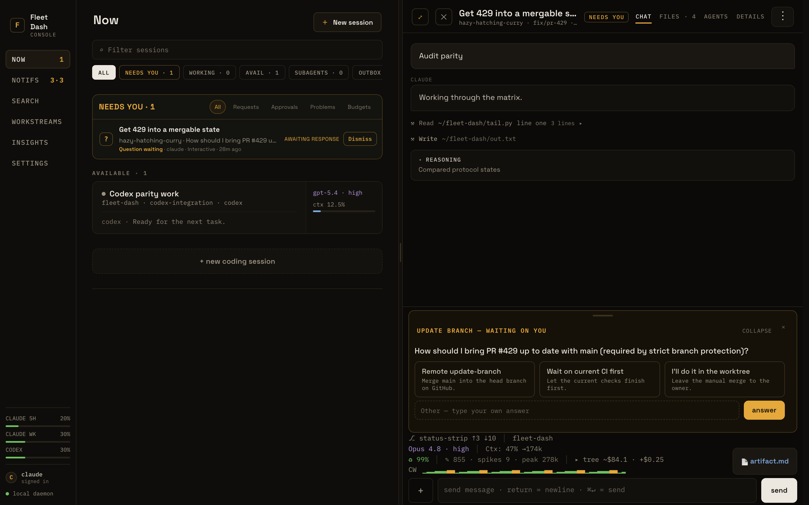
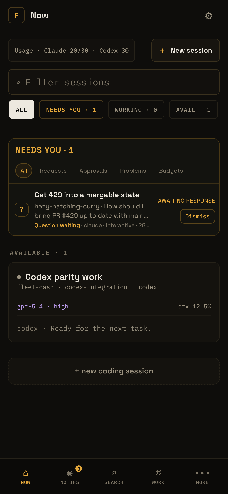
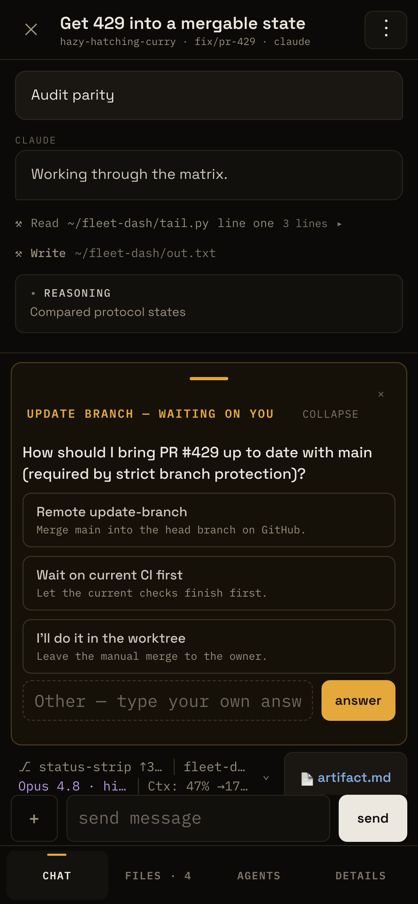
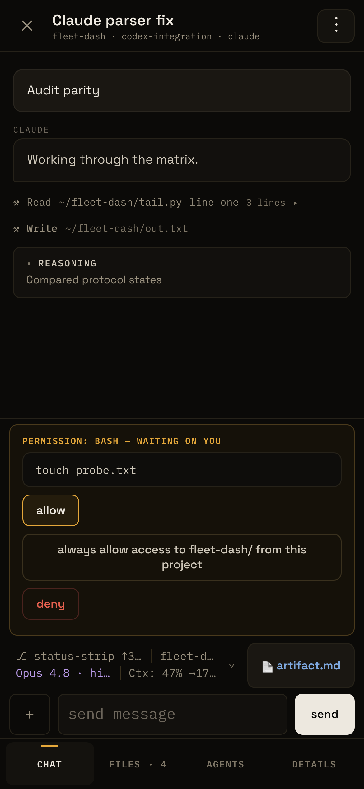
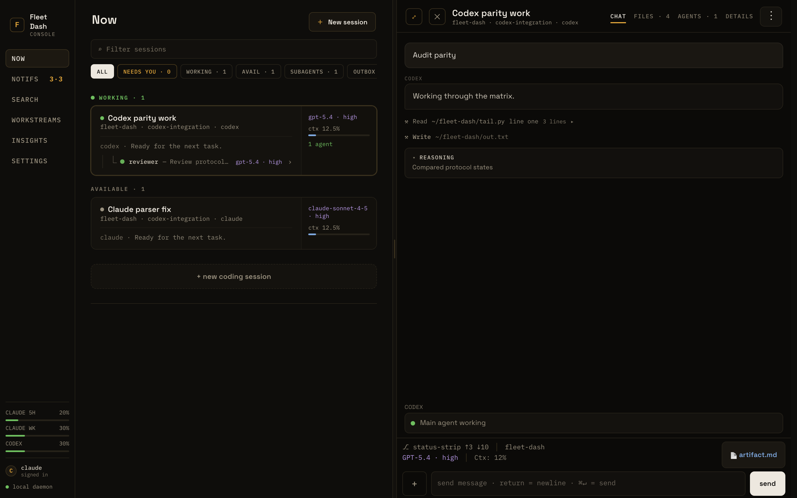

# fleet-dash

<p align="center"><strong>One screen for every Claude Code and Codex CLI session on your Mac, and a way to answer them from your phone.</strong></p>

<p align="center">
  <a href="LICENSE"></a>
</p>

<p align="center"></p>

Coding agents stop and wait: a question, a permission prompt, a finished turn. With a dozen sessions across projects and worktrees, the one that needs you is always in a terminal tab you are not looking at. fleet-dash watches all of them, puts the ones that need you at the top, and turns each pending prompt into buttons. Tap one and the answer is typed into the real session. It is for a developer who runs many Claude Code or Codex CLI sessions at once on their own Mac.

Status: no release yet. You run it from a clone.

## Try it

You need git and Python 3; the fixture server uses only the standard library and serves synthetic sessions, so it touches nothing on your machine. The browser tests run against this fixture server. It is the quickest way to click through the interface:

```bash
git clone https://github.com/federbenjamin/fleet-dash.git && cd fleet-dash
python3 tests/browser_fixture_server.py
# then open http://127.0.0.1:8399/?token=abcdef123456
```

Every screenshot on this page was taken that way (`scripts/readme-screenshots.js`).

## Features

- **A queue, not a list.** `Now` sorts sessions into *Needs you*, *Working*, and *Available*. Questions, approvals, MCP forms, reply requests, and errors land in one action inbox.
- **Answer from anywhere.** A pending `AskUserQuestion`, a permission prompt, or an MCP form becomes tappable options. The answer goes through the provider's own control path: keys into the Claude terminal, or the Codex App Server.
- **The whole conversation.** Each session opens a workspace with the full chat (messages, tool calls, reasoning), the files it delivered, its subagents, and its details. Send a message, interrupt, or queue one for when it is free.
- **Subagents in view.** Every session shows its live agents, their models, and what they are doing.
- **Usage at a glance.** Context percentage per session, account usage windows for both providers, and cost by day, model, skill, and tool.
- **Push when it matters.** Web Push to your phone for prompts, failures, and long stalls, with snooze and mute. Lock-screen text carries no session content.
- **Search everything.** A local index over every transcript, running in its own low-priority process.
- **Works offline, honestly.** An installable PWA that opens the last snapshot read-only and says so. It never retries a send whose outcome it cannot know.

<table>
  <tr>
    <td></td>
    <td></td>
    <td></td>
  </tr>
  <tr>
    <td align="center">What needs you</td>
    <td align="center">Answer a question</td>
    <td align="center">Approve a command</td>
  </tr>
</table>



## Usage

Open the dashboard and work from `Now`:

1. A session that needs you sits under *Needs you*. Open it to see its chat, files, subagents, and details.
2. A waiting question or permission prompt shows as buttons at the bottom of the session. Tap one, and the answer is typed into the real session.
3. Type in the composer to send a message. A busy session holds it in the Outbox until the session is free.

In the `Try it` server, the session *Get 429 into a mergable state* is waiting on a question, so you can try all three:

```
http://127.0.0.1:8399/?token=abcdef123456
```

Running it on your own sessions needs the daemon under launchd, a Claude Code hook, and a token on each device; the [reference](docs/reference.md#manual-setup--already-done-on-this-mac) lists each step.

## Configuration

fleet-dash was built for one person's Mac and is not packaged. It needs macOS, Python 3, and Claude Code; tmux, the Codex CLI, Tailscale, and Node 18+ (for push) are optional. Setup, configuration, phone onboarding, and the known gaps are in the [reference](docs/reference.md).

## How it works

A small Python daemon (`server.py` and the `fleetdash/` package, standard library only) runs under launchd and serves a no-build browser app: sixteen plain ES modules, no bundler, no framework.

- **Reading.** It polls Claude Code's session registry and tails each session's transcript and subagent files incrementally. Codex sessions come through the Codex App Server protocol.
- **Prompts.** A Claude Code hook captures a question the moment it is asked, because the transcript only records it after it is answered.
- **Writing.** An answer is typed into the session's own terminal: `tmux send-keys` when the session lives in a tmux pane, a signed macOS applet for iTerm2 otherwise.
- **Storage.** SQLite for the ledger of finished work and for search. The dashboard sends nothing off the machine except the push notifications you turn on.
- **Reach.** The dashboard binds to localhost by default. A phone reaches it over your own Tailscale network.

### Built to type into a live terminal safely

Sending keystrokes to a running agent is the dangerous part, so most of the design is about refusing to do it wrong.

- **Every prompt has one identity.** A question answered on one device cannot be answered again from another; the second tap is told it was already answered.
- **It looks before it types.** In tmux, the pane is read first. If it shows a different prompt, or a plain input box, the keys are refused.
- **Every action leaves a receipt.** The browser mints an id before it sends. A phone that loses its connection mid-answer asks what happened; resending the same id never types twice.
- **Unknown is not retried.** If a write may have reached the terminal, it is marked uncertain and left for you.
- **Mutation needs a token.** Read-only without it; a device gets the token once, by hand.
- **Staging cannot touch production sessions.** The development instance sees real sessions and can change only the ones it created.

The rules behind these are numbered and kept in [`AGENTS.md`](AGENTS.md).

### More

- [`docs/reference.md`](docs/reference.md): every feature, setup step, and config key.
- [`docs/session-organization.md`](docs/session-organization.md): how a session is placed in the queue.
- [`design-system/`](design-system/): the "Console" visual language.
- [`docs/postmortems/`](docs/postmortems/) and [`docs/roadmaps/`](docs/roadmaps/): what went wrong and what was planned.

## Contributing

Report a problem in [GitHub Issues](https://github.com/federbenjamin/fleet-dash/issues). Pull requests are welcome; read the [contributing guide](https://github.com/federbenjamin/.github/blob/main/CONTRIBUTING.md) first, and report a security issue as the [security policy](https://github.com/federbenjamin/.github/blob/main/SECURITY.md) says, not in a public issue.

```bash
python3 -m unittest discover -s tests -p 'test_*.py'   # the engine, against fake providers
scripts/coverage.sh --show-missing                      # the same suite under coverage
npm install && npx playwright install chromium
npm run test:browser                                    # the interface, desktop and phone sizes
npm run test:push                                       # the push worker and service worker
```

Coverage is held at 95% or more per Python module.

## License

MIT © Benjamin Feder. See [LICENSE](LICENSE). The bundled fonts in `static/fonts/` (IBM Plex Mono, Space Grotesk) are under the SIL Open Font License.
